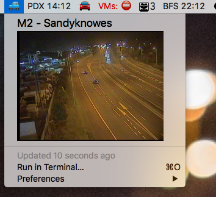

# NI Trafficwatch Bitbar Camera Plugin

This repo contains a simple Bitbar plugin built in Go using the [go-bitbar](https://github.com/johnmccabe/go-bitbar) library which pulls Traffic camera images from the NI Trafficwatch website.

This repo is intended to demonstrate the use of the [go-bitbar](https://github.com/johnmccabe/go-bitbar) library and was presented during a live-coding lightning talk at GDG Belfast in October 2018.
